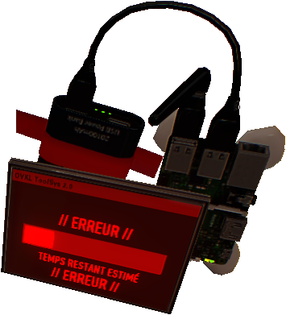
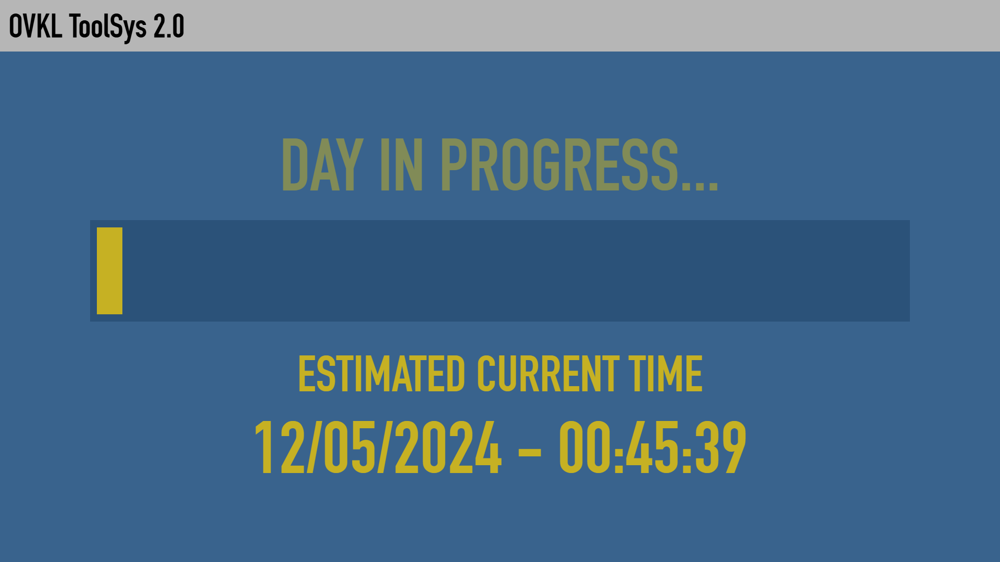
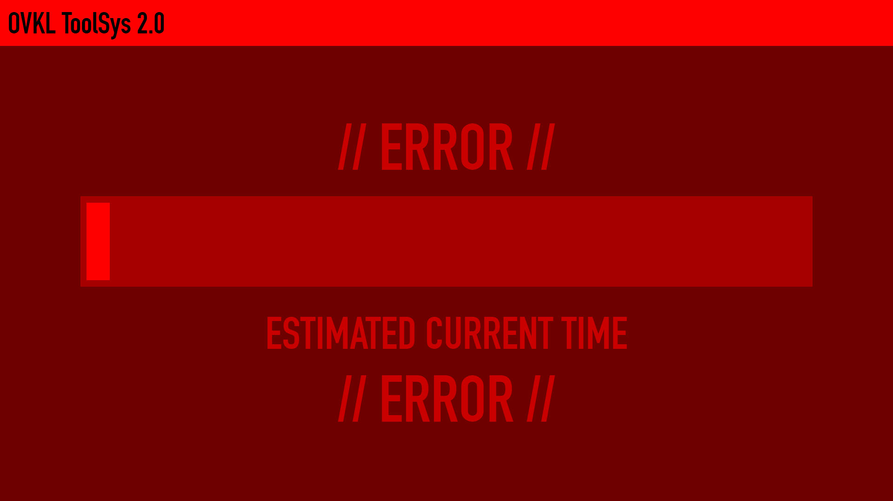

     
    
     
     
    <a href="https://payday-2-clock.com" target="_blank">
        <b>• View online version •</b>
    </a>
     
     
    
    
     
     

# Payday 2 - Clock

 Clock inspired by the screens of hackbox in the game Payday 2.

## Preview screenshots

 *Hack mode :*

 

 *Error mode :*

 

## How to use?

 You can change mode by clicking anywhere on the window.

 You can also change language by hovering over the gray "OVKL ToolSys 2.0" bar at the top.

 Have fun! 😉

## License and Usage Restrictions

 This project is licensed under a custom license that **prohibits commercial use**.

 For more details, see the [LICENSE](./LICENSE) file.
